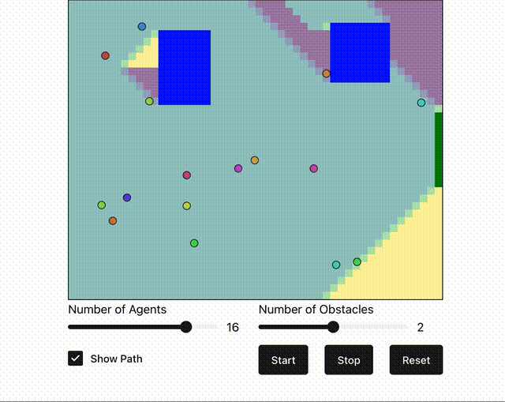

# Social Force Model Simulation



This is an [extremely] simple yet interesting implementation of the original social force model proposed by Helbing and Molnar in 1995.

After setting parameters and clicking "Start", the simulation begins. The obstacles' sizes/locations and agents' initial positions are randomly generated. Please note that crash detection between agents and obstacles has not been implemented yet, so you can see some ranbunctious agents are roaming into the obstacles [and each others].

The project is built with [FastAPI](https://fastapi.tiangolo.com/) and [React](https://react.dev/) + [Vite](https://vitejs.dev/).

## Run it locally

```bash
cd backend
pip install -r requirements.txt
uvicorn main:app --reload --port 8000 --host 0.0.0.0
```

The project should be running on `http://0.0.0.0:8000/`.
